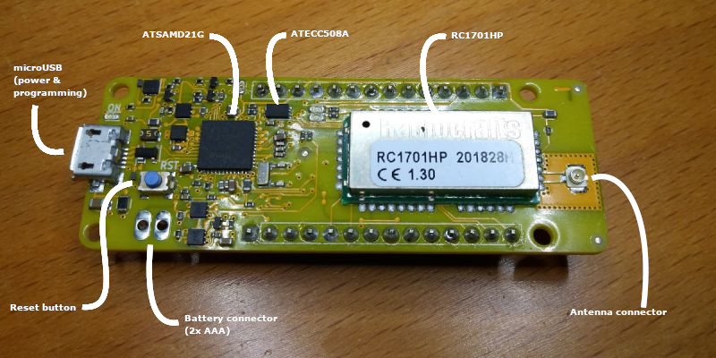

# AllWize K2 Components

The AllWize K2 board is a stand-alone prototyping board that packs all the required components to create a low-power long-range solution with Wize. The main elements in the board are:

* Atmel ATSAMD21G128A microcontroller
* Radiocrafts RC1701HP radio module
* Microchip ATECC508A crypto element
* Texas Instruments TLV757P regulator

Everything in a MKR form factor (same as the Arduino MKRWAN1300 or the MKRFOX).

[Tutorial menu](readme.md) |
[Next: Installing the Arduino IDE](02-install-arduino-ide.md)
