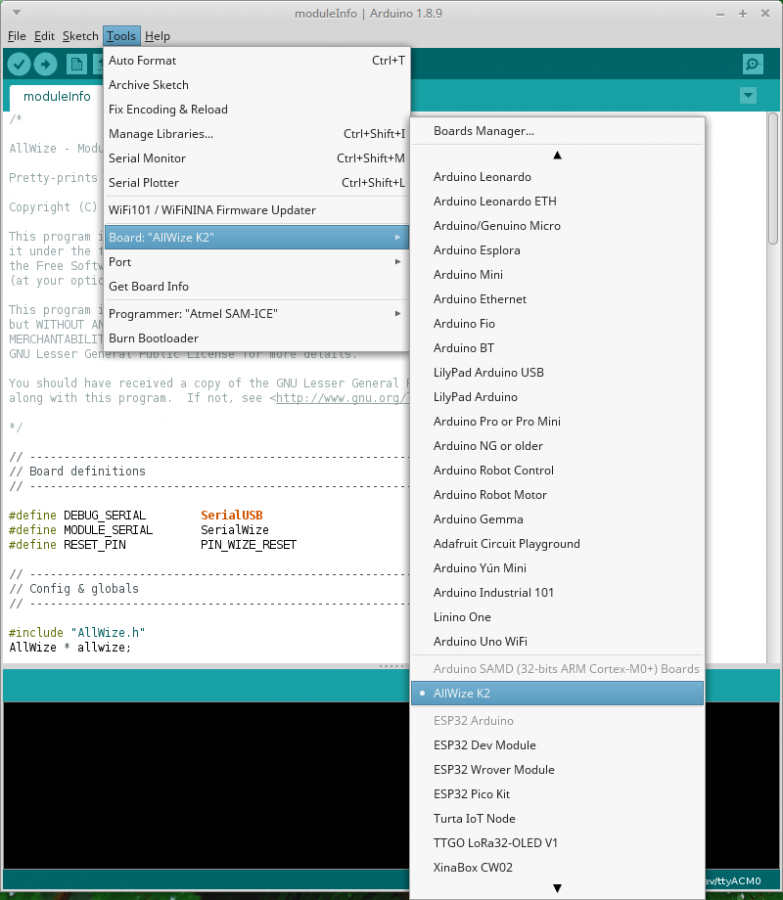

# Adding support for the AllWize K2 in the Arduino IDE

Starting with 1.6.4, Arduino allows installation of third-party platform packages using Boards Manager.

* Install the current upstream Arduino IDE at the 1.8.7 level or later. The current version is on the Arduino website.
* Start Arduino and open the Preferences window.
* Enter https://raw.githubusercontent.com/AllWize/allwize-boards/master/package_allwize_boards_index.json into the Additional Board Manager URLs field. You can add multiple URLs, separating them with commas.

    

* Open the Boards Manager at `Tools > Board ... > Boards Manager` and install support for these boards (you will need the two of them):

    * Arduino SAMD Boards (32-bits ARM Cortex-M0+)
    * Allwize SAMD Boards (32-bits ARM Cortex-M0+)

    

* Don't forget to select your AllWize board from `Tools > Board ...` menu after installation.

    

[Previous: Installing the Arduino IDE](02-install-arduino-ide.md) |
[Tutorial menu](readme.md) |
[Next: Install the AllWize library](04-allwizek2-allwize-library.md)