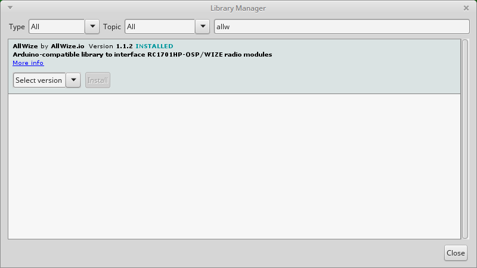

# Install the AllWize library

The last step is to install the AllWize library from the Arduino Library Manager. This library interfaces the RC1701HP radio module and eases the development.

Go to `Sketch > Include Library > Manage Libraries` and search and install the `AllWize` library.

[Previous: Adding support for the AllWize K2 in the Arduino IDE](03-allwizek2-arduino-ide-support.md) |
[Tutorial menu](readme.md) |
[Next: Simple code example](05-allwizek2-hello-world.md)