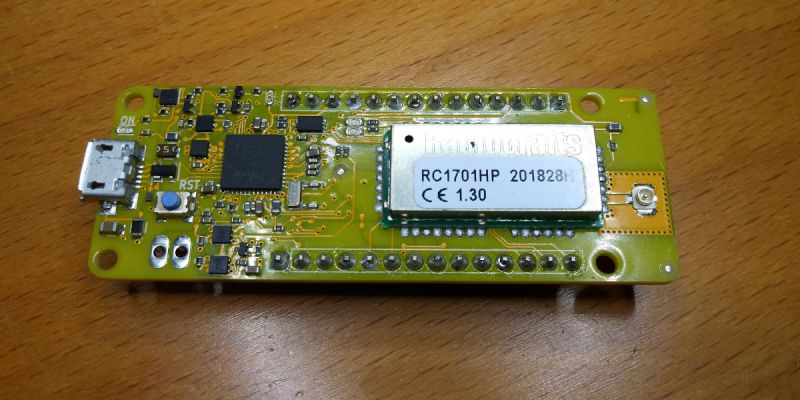

# Getting started with the AllWize K2

## Index

1. [Identifying the components](01-allwizek2-components.md)
2. [Installing the Arduino IDE](02-install-arduino-ide.md)
3. [Adding support for the AllWize K2 in the Arduino IDE](03-allwizek2-arduino-ide-support.md)
4. [Install the AllWize library](04-allwizek2-allwize-library.md)
5. [Simple code example](05-allwizek2-hello-world.md)

## Reference links

* [AllWize K2 product page](https://www.allwize.io/product-page/the-allwize-k2)
* [AllWize K2 wiki page](http://wiki.allwize.io/index.php?title=Allwize_K2)
* [AllWize K2 Github repository](https://github.com/AllWize/AllWizeK2-hardware)
* [AllWize K2 Schematic (PDF)](https://github.com/AllWize/AllWizeK2-hardware/raw/master/RevPA/AllWize%20K2%20-%20RevPA.pdf)

## License

All contents in this repository are under the Creative Commons Atribution ShareAlike 4.0 International license [CC BY-SA 4.0](https://creativecommons.org/licenses/by-sa/4.0/).

