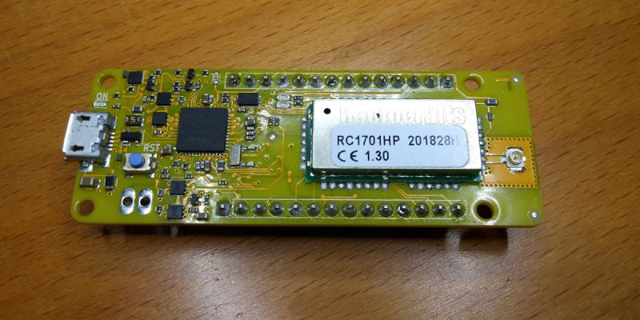
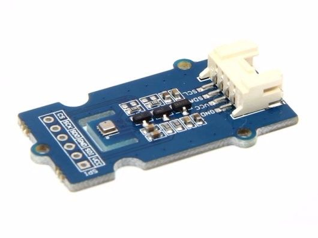
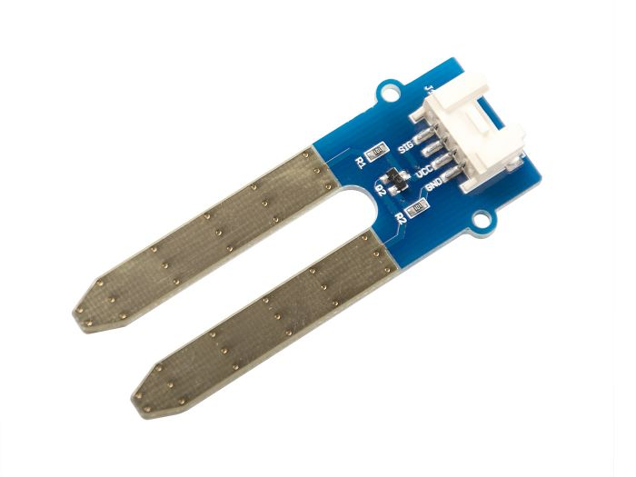
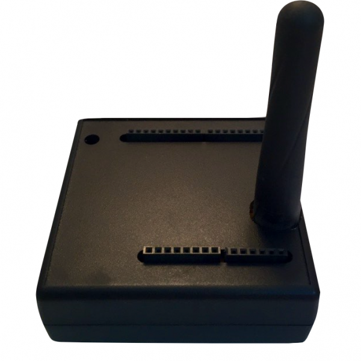
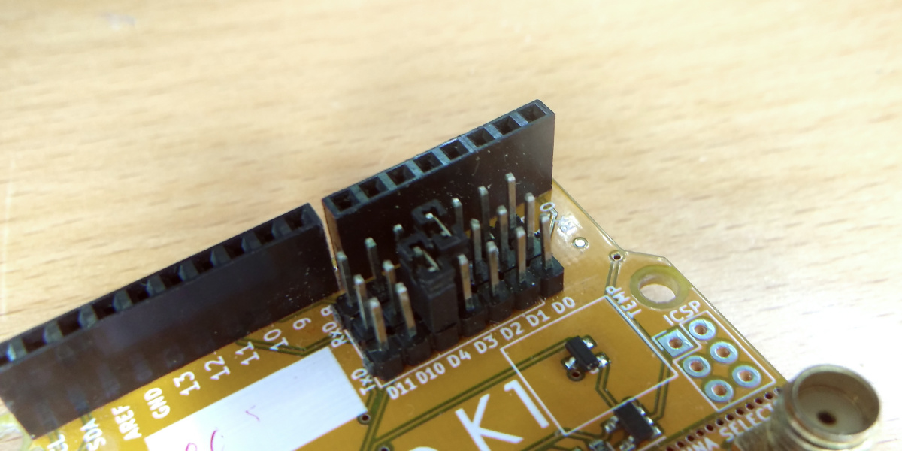

# What elements will we be using?

## Device

Our device brains will be an AllWize K2 with an external battery pack. 

We will use an [Arduino MKR Connector Carrier](https://store.arduino.cc/arduino-mkr-connector-carrier) to help connecting the sensors to the device.

.

These sensor will be a [BME280](https://www.seeedstudio.com/Grove-BME280-Environmental-Sensor-Temperature-Humidity-Barometer.html) temperature, pressure and humidity sensor and a [moisture sensor](https://www.seeedstudio.com/Grove-Moisture-Sensor.html), both by SeeedStudio.

## Gateway

As a gateway we will use an AllWize G1, which is an Wemos D1 ESP8266-based board and an AllWize K1 shield. This board with forward the Wize messages to our platform via our WiFi connection.

The AllWize G1 is available in the [AllWize shop](https://www.allwize.io/wize-iot-dev-kits) or you can buy just the AllWize K1 and stack it on a Wemos D1 (or equivalent) board. The only hardware configuration you will have to do is to set the RX/TX jumpers to the proper positions. This is necessary because the ESP8266 has only one hardware serial (OK, one and a half) and it's used by the USB connector, so we have to use two general IO pins as SoftwareSerial ports. Check the image below to see the configuration the examples in the library are configure to use. 

[Tutorial menu](readme.md) |
[Next: Device connections](02-device-connections.md)
